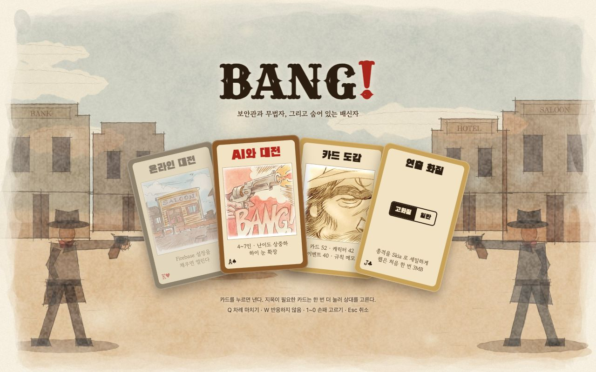
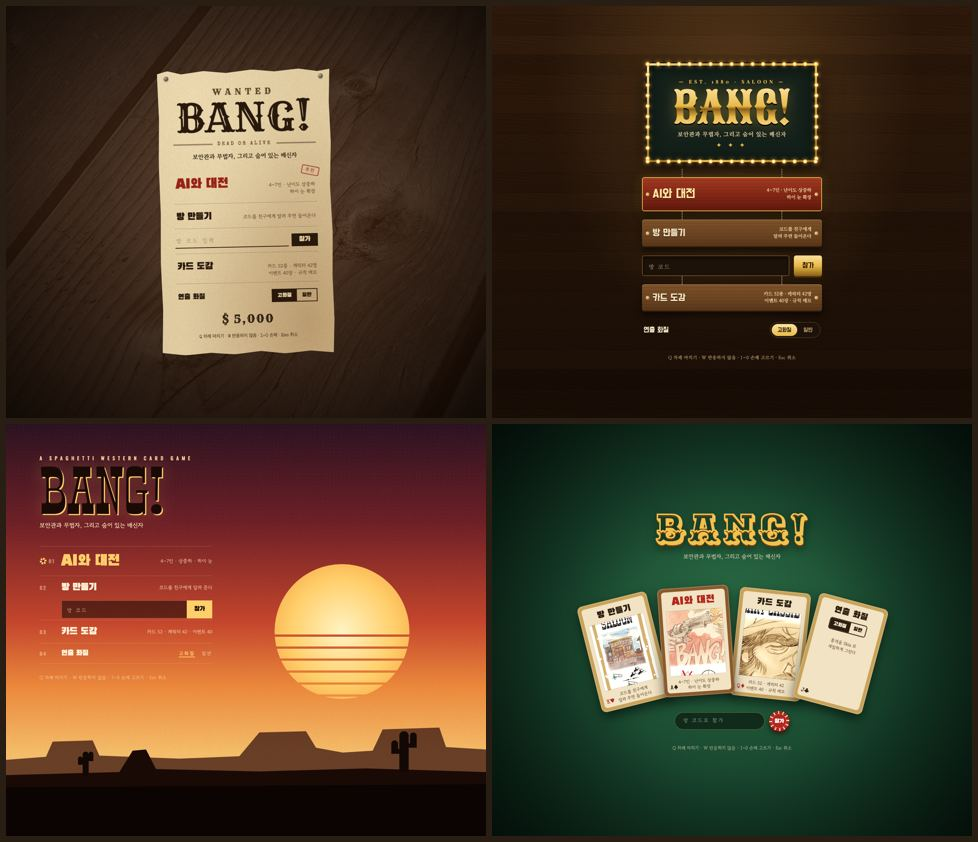
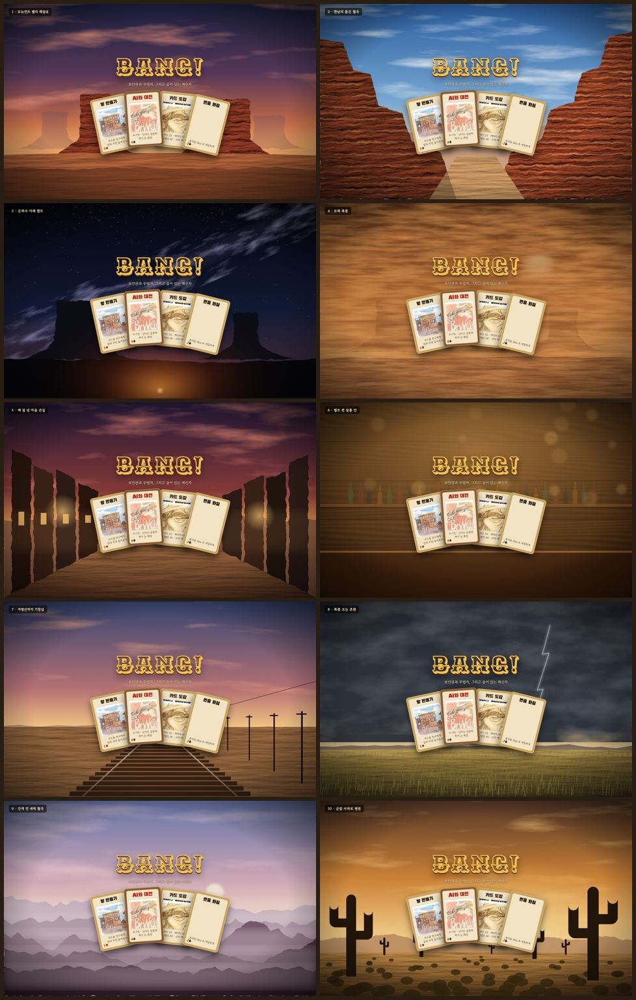
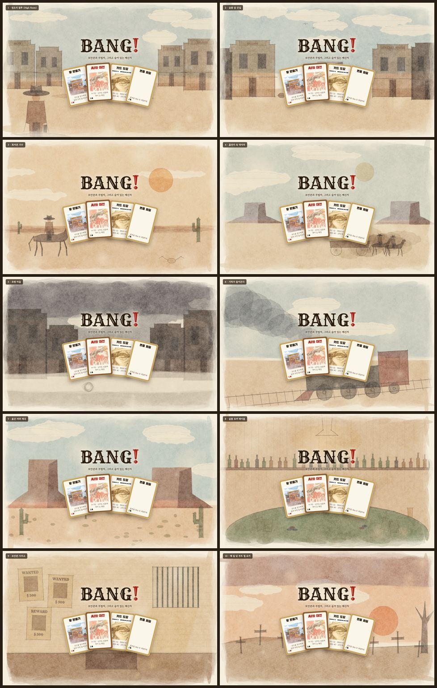
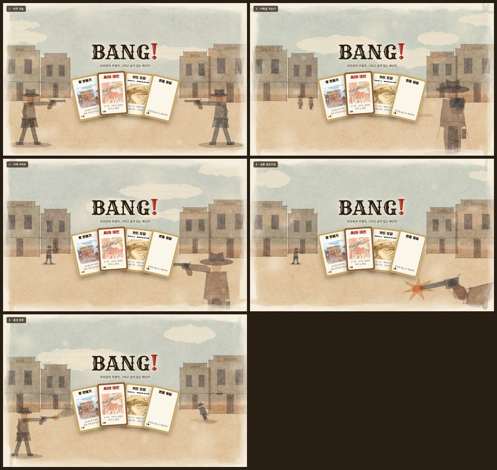

# 첫 화면 디자인

첫 화면(`src/app/index.tsx`)을 갈색 버튼 목록에서 **정오의 큰길 수채 그림 + 손패처럼 펼친 메뉴 카드**로
바꾼 기록이다. 무엇을 거쳐 지금 모양이 됐는지, 다시 손볼 때 어디를 고치면 되는지 적는다.



## 지금 모양

- **바탕:** `assets/board/menu-high-noon.jpg` (1600×1000). 크림색 종이 위에 연필·잉크 선과 수채로 그린
  큰길이다. 양 끝에 선 두 총잡이가 서로를 겨누고, 가운데 제목과 카드가 두 총구 사이에 놓인다
- **메뉴:** 메뉴 한 칸이 플레잉 카드 한 장이다. 실제 카드 그림을 잘라 넣었다

  | 카드 | 귀퉁이 | 그림 | 누르면 |
  |---|---|---|---|
  | AI와 대전 | A♠ | 뱅! | `/local` |
  | 방 만들기 (Firebase 없으면 잠긴 "온라인 대전") | K♥ | 살롱 | `/room/new` |
  | 카드 도감 | Q♦ | 바트 캐시디 초상 | `/cards` |
  | 연출 화질 | J♣ | 그림 칸 대신 고화질/일반 토글 | — |

- **배치:** 폭 640px 이상이면 부채꼴(기울기 -13° -4° 6° 14°), 좁으면 2×2. 마우스를 올리거나 누르면
  카드가 똑바로 서며 떠오른다 (Reanimated CSS transition)
- **방 코드 참가:** 알약 모양 입력칸 + 포커칩 버튼
- **글자:** 제목은 Rye(나무 활자체) 잉크색에 느낌표만 빨강. 카드 이름은 Black Han Sans,
  설명은 Gowun Batang, 귀퉁이·방 코드는 Special Elite. 웹만 Google Fonts에서 받고, 앱은 시스템 굵은 글꼴로 그린다

| 파일 | 하는 일 |
|---|---|
| `src/app/index.tsx` | 화면 배치, 카드 네 장 정의, 부채꼴/2×2 전환 |
| `src/game/ui/menu/MenuCard.tsx` | 카드 한 장 (테두리·제목·그림 칸·설명·귀퉁이, 떠오르기). `CroppedArt` 로 스캔에서 그림 칸만 자른다 |
| `src/game/ui/menu/MenuBackdrop.tsx` | 바탕 그림. 창 크기에 맞춰 cover 로 깐다. 그림이 없으면 종이색만 |
| `src/game/ui/menu/western-fonts.ts` | 웹 글꼴 스타일시트 주입, 글꼴 이름 |
| `src/game/ui/QualityPicker.tsx` | `QualityToggle` (카드 안 두 칸 토글), `useFxQuality`, `qualityHint` |
| `src/game/ui/card-art.ts` | `menuBackdropArt()` |
| `src/game/ui/menu/PaperUi.tsx` | 메뉴 화면 공통 종이 장식: `PaperInk` 색, `PaperSheet`, `PaperHeading`, `PaperSection`, `StampButton`, `InkLink` |

### 판 설정 · 카드 도감

첫 화면과 같은 종이 장식을 쓴다 (`src/game/ui/menu/PaperUi.tsx`).

- **바탕:** 같은 수채 그림에 종이색 베일을 덮어 옅게 깐다 (`<MenuBackdrop veil={0.55} />`, 도감은 0.6). 글이 많은 화면이라 그림은 뒤로 물린다
- **종이 한 장:** 내용은 `PaperSheet` 안에 담는다. 반투명 인쇄 종이, 옅은 잉크 테두리, 그림자
- **제목:** `PaperHeading` — 위에 Rye 영문 활자(GAME SETUP, CARD CATALOG), 아래 굵은 한글, 밑에 두 줄 괘선
- **소제목:** `PaperSection` — 소제목 옆으로 점선 괘선이 이어진다
- **칩:** `src/game/ui/Chip.tsx` — 잉크 테두리 알약. 고르면 잉크 도장처럼 까맣게 찬다. 도감 탭은 같은 모양을 한 줄로 붙였다
- **시작 버튼:** `StampButton` — 빨간 도장. 안쪽에 점선 테두리, 누르면 눌린다
- **저장한 판 · 도감 상세 창:** 같은 잉크·종이 색으로 바꿨다 (`SavedGames.tsx`, `codex/CodexDetail.tsx`)

## 거쳐 온 길

### 1. 메뉴 배치 시안 4개

기존 화면(갈색 상자 버튼 다섯 개)을 그대로 두고 서부극 느낌만 다르게 입혀 봤다.
HTML 한 장씩, 빌드 없이 연다.



| | 시안 | 남긴 것 |
|---|---|---|
| A | [현상수배 포스터](menu-prototypes/a-wanted.html) | 정보는 가장 잘 읽히지만 장식이 적다 |
| B | [살롱 간판](menu-prototypes/b-saloon.html) | 지금 테마와 가장 이어진다 |
| C | [석양의 황야](menu-prototypes/c-sunset.html) | 영화 포스터 같다 |
| D | [카드 테이블](menu-prototypes/d-cardtable.html) | **골랐다.** 메뉴가 카드 한 장씩이라 카드 게임인 게 바로 보인다 |

`assets/board/felt.jpg` 는 이름과 달리 가게 안에서 찍은 가죽 사진이라 D의 펠트는 CSS로 그렸다.

### 2. D + 석양 황야 → 앱에 첫 적용

D의 카드 부채에 C의 석양(SVG 그라데이션 하늘, 줄무늬 해, 메사·선인장 실루엣)을 깔아 앱에 넣었다.
이때 생긴 것이 지금도 쓰는 `MenuCard`, `QualityToggle`, 부채꼴/2×2 전환이다.

- 화질 고르기 카드는 안에 버튼이 따로 있어서, 카드 전체를 `button` 으로 감싸면 웹에서
  `<button> cannot contain a nested <button>` 경고가 났다. 누를 곳이 없는 카드는 역할을 주지 않는다
- 잠긴 카드를 `opacity` 로 흐리게 하면 뒤 배경이 비쳤다. 테두리를 회색으로 바꾸고 종이색 베일을 덮는다

### 3. 더 사실적인 배경 10개 → 탈락

SVG 필터(feTurbulence 잡음 + feDiffuseLighting 조명)로 바위·구름·먼지 질감을 낸 사실풍 배경
10가지([backgrounds.html](menu-prototypes/backgrounds.html)). 모뉴먼트 밸리, 협곡, 은하수, 모래 폭풍,
마을 큰길, 살롱 안, 기찻길, 폭풍 초원, 안개 협곡, 사와로 평원.



"다 별로"였다. 사진처럼 보이려 할수록 카드 그림과 따로 놀았다.

### 4. 카드 그림체를 흉내 낸 수채 배경 10개

방향을 바꿨다. 사진처럼 만들지 말고 **카드 일러스트의 그림체**를 따른다.
저장소의 카드 그림(이벤트 카드 정오의 결투·유령 마을·갈증, 역마차·살롱·결투 등)을 나란히 놓고 본 특징이다.

- 연필로 잡고 잉크로 따라 그은 흔들리는 선. 모서리마다 선이 조금씩 삐져나간다
- 그림자는 연필 빗금
- 수채: 안료 알갱이, 마르며 진해진 가장자리, 군데군데 비는 마른 붓 자국
- 네모 틀 없이 크림색 종이 여백으로 흩어져 사라지는 가장자리
- 따뜻한 황토·세피아 + 옅은 하늘색. 장면은 영화처럼 앞쪽 클로즈업과 먼 인물을 겹친다

이걸 캔버스 2D로 절차적으로 흉내 냈다 ([sketch-backgrounds.html](menu-prototypes/sketch-backgrounds.html)).

| 함수 | 흉내 내는 것 |
|---|---|
| `wash` | 다각형 변을 반씩 쪼개며 흔들고(`deform`) 옅게 18겹 쌓는다. 알갱이 잡음으로 덜어 내고, 마른 붓 자리를 비우고, 가장자리를 한 번 더 긋는다 |
| `lift` | 종이색으로 덧칠해 하늘에 구름 자리를 비운다 |
| `ink` | 6px 마다 점을 다시 찍어 떨리게 긋고 두 번 겹친다. 모서리 있는 도형은 변마다 따로 그어 끝이 삐져나간다 |
| `hatch` | 다각형 안을 각도대로 빗금 친다. 선마다 길이가 조금씩 다르다 |
| `paper` · `vignetteMask` | 종이 결과 섬유, 붓을 끌고 나간 듯한 가장자리 |

첫 판은 색이 고르게 칠해져 클립아트처럼 보였다. 알갱이·마른 붓·가장자리 진하게를 넣고 채도를 올린 뒤에야
수채처럼 보였다.



### 5. 1번(정오의 결투)에 총 겨누기 5가지 → 1번 "마주 겨눔"

1번 큰길 위에 총을 겨누는 구도를 다섯 가지로 그렸다 (`?aim=1`~`5`).
마주 겨눔, 이쪽을 겨눈다, 어깨 너머로, 권총 클로즈업, 총성 직후.



인물은 카드 부채(화면 가운데 약 45%)를 피해 양 끝에 세웠다. 가운데에 두면 카드에 가려졌다.
**마주 겨눔**을 골랐다. 두 총구 사이에 카드가 놓여 메뉴 자체가 결투의 한가운데가 된다.

## 바탕 그림 다시 뽑기

바탕은 실시간으로 그리지 않는다. 수채 겹이 수백 번이라 첫 화면이 느려진다.
시안 HTML에서 한 번 그려 JPG로 저장해 둔다.

```bash
cd docs/menu-prototypes
"/Applications/Google Chrome.app/Contents/MacOS/Google Chrome" --headless=new --hide-scrollbars \
  --allow-file-access-from-files --virtual-time-budget=20000 --window-size=1600,1000 \
  --screenshot=/tmp/bare.png "file://$PWD/sketch-backgrounds.html?aim=1&bare=1"
python3 -c "from PIL import Image; Image.open('/tmp/bare.png').convert('RGB').save('../../assets/board/menu-high-noon.jpg', quality=86, optimize=True, progressive=True)"
```

- `&bare=1` 은 제목·카드를 빼고 배경만 그린다
- 난수는 시드를 고정해서 같은 주소면 같은 그림이 나온다. 그림을 바꾸려면 장면 함수를 고치거나 시드를 바꾼다
- 새 그림 파일을 넣으면 Metro 를 다시 시작해야 `require.context` 에 잡힌다 (`docs/assets.md`)

## 다시 손볼 때

- **인물이 카드에 가린다:** 장면의 `aimingCowboy(c, x, ...)` x 를 바깥으로 민다. 캔버스 1600 기준으로 카드는 약 440~1160 을 차지한다
- **양 끝 사람이 잘린다:** 바탕은 창 크기에 cover 로 맞춘다 (`MenuBackdrop`). 창이 1.6:1 보다 좁으면 양옆이 잘린다.
  폰 세로 화면에서는 큰길 가운데만 보인다
- **화면이 길어져 그림이 확대된다:** 바탕을 화면 View 가 아니라 `useWindowDimensions` 크기로 깐 이유다.
  흐름 안 크기를 따르면 내용 높이만큼 그림이 커져 양 끝이 잘렸다
- **글자가 하늘 위에서 안 읽힌다:** 제목·부제·안내 글에 종이색 `textShadow` 를 둘렀다. 그림을 더 진하게 바꾸면 반경을 늘린다
- **앱 글꼴:** iOS·Android 에는 아직 서부 글꼴 파일을 넣지 않았다. 넣으려면 `expo-font` 로 불러오고
  `western-fonts.ts` 의 `WesternFonts` 를 플랫폼 공통 이름으로 바꾼다
- **저작권:** 메뉴 카드 안의 그림은 카드 그림(dV Giochi) 그대로다. 바탕 그림은 절차적으로 새로 그린 것이다.
  공개 배포 전 검토는 `docs/assets.md` 와 같다
